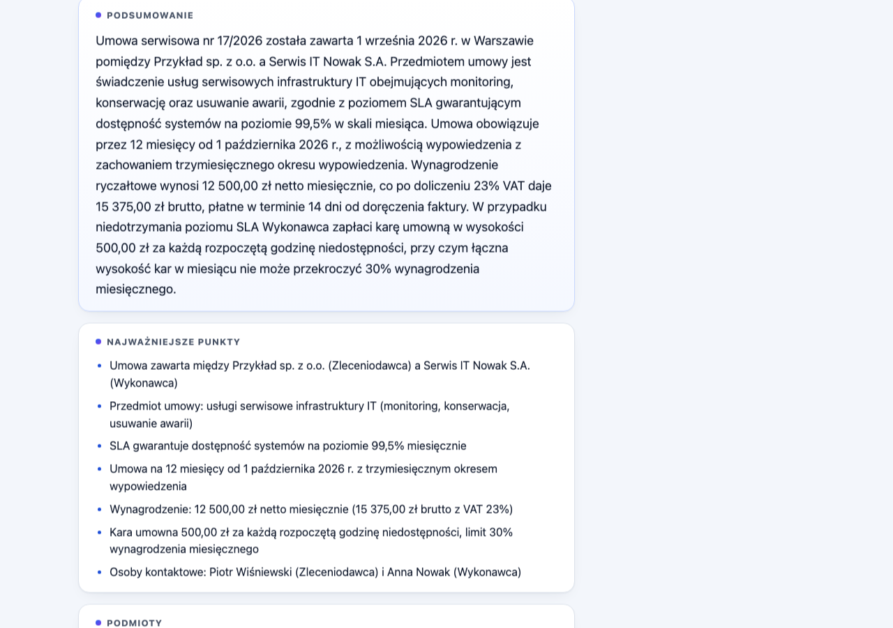
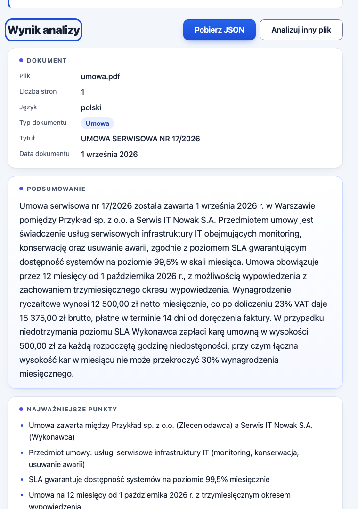

# PDF Insight

Aplikacja webowa, która wczytuje plik PDF, tworzy krótkie podsumowanie (3–5 zdań w języku dokumentu)
i zamienia treść w uporządkowane dane JSON zgodne ze stałym schematem. Zadanie rekrutacyjne
na stanowisko **Vibe Coder**.

## Demo

**https://lukas752.github.io/pdf-insight/**





Jak sprawdzić w 30 sekund: otwórz link, przeciągnij dowolny PDF z warstwą tekstową (umowa, faktura,
raport – po polsku lub po angielsku), poczekaj kilka sekund, kliknij **Pobierz JSON**.

## Architektura

```
Przeglądarka (GitHub Pages, statycznie)    Cloudflare Worker             Anthropic API
┌──────────────────────────────┐          ┌──────────────────────┐      ┌──────────────┐
│ React 19 + TypeScript + Vite │          │ POST /api/analyze    │      │ Claude       │
│ pdf.js odczytuje tekst       │  tekst → │ klucz w sekretach    │ → →  │ tool-use     │
│ Zod waliduje odpowiedź       │  ← JSON  │ CORS: lista originów │ ← ←  │ strict JSON  │
│ localStorage: historia       │          │ limit żądań (KV)     │      │              │
└──────────────────────────────┘          └──────────────────────┘      └──────────────┘
```

**Kluczowa decyzja: tekst z PDF jest wyodrębniany w przeglądarce** (pdf.js). Plik binarny nigdy nie
opuszcza urządzenia użytkownika – do Workera trafia wyłącznie czysty tekst, a Worker przekazuje go
do API Anthropic. Daje to trzy rzeczy:

1. mniejsze i szybsze żądania, zero obsługi uploadu plików po stronie backendu;
2. uczciwą informację o prywatności: _„plik zostaje na Twoim urządzeniu; do API AI wysyłany jest
   tylko wyodrębniony tekst”_;
3. powierzchnię ataku Workera ograniczoną do jednego endpointu JSON.

Przepływ danych w pięciu zdaniach: użytkownik upuszcza PDF, a `validateFile` sprawdza rozszerzenie,
typ i rozmiar (≤ 10 MB). `lib/pdf.ts` otwiera plik w pdf.js, czyta tekst strona po stronie i odrzuca
skany bez warstwy tekstowej. Jeśli tekst przekracza 40 000 znaków, `lib/chunk.ts` dzieli go na
fragmenty po ~30 000 znaków z zakładką, a `api/client.ts` wysyła każdy fragment do Workera (maksymalnie
4 równolegle; pierwszy błąd zatrzymuje resztę). Worker waliduje żądanie Zodem, sprawdza limit, wywołuje
Claude z wymuszonym narzędziem `emit_document_analysis` i zwraca surowe dane, w których podsumowanie
jest listą 3–5 zdań. Klient waliduje odpowiedź schematem Zod (jedna automatyczna ponowna próba przy
błędzie walidacji), łączy fragmenty w `lib/merge.ts`, zamawia jedno końcowe streszczenie i dopiero
zwalidowany wynik trafia do widoku, podglądu JSON, pobrania i historii.

## Podjęte decyzje

| Decyzja                                                                  | Uzasadnienie                                                                                                                                                                                                                                                                                                                                                                                                                                                                                   |
| ------------------------------------------------------------------------ | ---------------------------------------------------------------------------------------------------------------------------------------------------------------------------------------------------------------------------------------------------------------------------------------------------------------------------------------------------------------------------------------------------------------------------------------------------------------------------------------------- |
| **Cloudflare Workers** jako proxy (zamiast Supabase / Vercel / serwer)   | Darmowy plan bez karty, brak cold startów, KV pod ręką do limitu żądań, sekret przez `wrangler secret put`. Jeden plik konfiguracji, jeden endpoint.                                                                                                                                                                                                                                                                                                                                           |
| **Ekstrakcja tekstu w przeglądarce** (pdf.js)                            | Prywatność (plik nie wychodzi z urządzenia), mniejsze żądania, prostszy backend. pdf.js (~430 kB) ładuje się leniwie dopiero przy pierwszej analizie, więc nie spowalnia pierwszego wyświetlenia strony.                                                                                                                                                                                                                                                                                       |
| **Tool-use z `tool_choice` i `strict: true`** zamiast prośby o JSON      | Model _musi_ wywołać narzędzie o zadanym schemacie, więc odpowiedź ma zawsze właściwy kształt i typy. Reguły, których strict mode nie obsługuje (3–7 punktów, formaty ISO, długości list), pilnuje Zod po stronie klienta – ostatnia bramka przed renderowaniem.                                                                                                                                                                                                                               |
| **Podsumowanie jako lista zdań** (`summarySentences`)                    | Reguła „3–5 zdań” jest liczona dokładnie po elementach listy, a nie heurystyką po kropkach. Pierwsza wersja liczyła kropki i odrzucała poprawne polskie podsumowania z „art. 5 ust. 2”, „ok. 500 zł” czy „sp. z o.o.” (szczegóły w `AI_LOG.md`). W publicznym JSON-ie pole `summary` pozostaje zwykłym tekstem – klient łączy zdania spacją.                                                                                                                                                   |
| Model **`claude-sonnet-5`** w zmiennej `ANTHROPIC_MODEL`                 | Szybki i tani, a jednocześnie wyraźnie lepszy od Haiku w ekstrakcji po polsku (jakość wyników to 20 % oceny). `effort: medium` skraca czas odpowiedzi przy zadaniu ekstrakcyjnym. Zmiana modelu nie wymaga zmiany kodu.                                                                                                                                                                                                                                                                        |
| Metadane `fileName` i `pages` wstawia **Worker**, nie model              | Model nie powinien przepisywać danych, które znamy na pewno; eliminuje to klasę błędów (literówki w nazwie pliku, zła liczba stron).                                                                                                                                                                                                                                                                                                                                                           |
| **Brak routera**                                                         | Aplikacja jednoekranowa – pułapka routingu na GitHub Pages omijana konstrukcyjnie. `public/404.html` przekierowuje na ścieżkę bazową. Gdyby router był potrzebny, musi to być `HashRouter`.                                                                                                                                                                                                                                                                                                    |
| **Brak frameworka UI**                                                   | Zwykły CSS z tokenami: mniej zależności do tłumaczenia, pełna kontrola kontrastu (wszystkie pary kolorów policzone wg WCAG: najniższa 4,25:1 dla obramowań, 6,6:1+ dla tekstu).                                                                                                                                                                                                                                                                                                                |
| **Chunking 30 000 znaków, zakładka 1 000, próg 40 000**                  | Większe fragmenty niż sugerowane 10 000 = mniej żądań (limit 20/10 min), szybciej i taniej; Sonnet 5 radzi sobie z takim fragmentem bez utraty jakości. Dzielenie na granicach akapitów, nigdy w środku słowa. 65-stronicowy dokument to ~4 żądania + 1 streszczenie.                                                                                                                                                                                                                          |
| **Łączenie fragmentów** deterministyczne                                 | `type` i `language` przez głosowanie większościowe (sama strona tytułowa nie może zaklasyfikować całego dokumentu), `title`/`date` = pierwsza niepusta wartość. Listy: unia + deduplikacja bez rozróżniania wielkości liter, `keyPoints` max 7 najwcześniejszych (nigdy poniżej 3), `keywords` max 10, `amounts` po `value+currency+context`, `dates` po `date+context`. Także wynik z jednego fragmentu przechodzi przez scalanie, więc listy są zawsze zdeduplikowane.                       |
| **OCR poza zakresem (F-10)**                                             | Skan jest wykrywany (< 200 znaków tekstu) i komunikowany po polsku. OCR w przeglądarce to kolejne megabajty i dziesiątki sekund – w 24-godzinnym budżecie lepiej mniej, ale dopracowane.                                                                                                                                                                                                                                                                                                       |
| Worker wdrażany **lokalnie** (`wrangler deploy`), nie z GitHub Actions   | Brak tokenu Cloudflare w sekretach GitHuba – im mniej sekretów w obiegu, tym bezpieczniej. Frontend wdraża się automatycznie z Actions.                                                                                                                                                                                                                                                                                                                                                        |
| Worker **samodzielny** (własny `package.json`, własny schemat żądania)   | Worker nie importuje nic z `src/`, więc jego bundel zawiera tylko kod Workera. Jedyny most to test jednostkowy sanityzatora (`tests/prompt.test.ts` importuje `worker/src/prompt.ts`). Schemat żądania to 10 linii, cena duplikacji jest niska.                                                                                                                                                                                                                                                |
| **Strażnik języka** (prompt + heurystyka + ponowna próba z podpowiedzią) | Test na żywo z angielskim listem motywacyjnym dał `language: en`, ale polskie podsumowanie – model potraktował polskie wartości enum `type` jako sygnał o języku. Prompt mówi to wprost, a klient sprawdza spójność: tekst z udziałem polskich liter (ą ę ł ń ś ź ż) powyżej 2 % przy języku innym niż `pl` (albo poniżej 1 % przy `pl`) jest odrzucany i ponawiany raz z jawną instrukcją języka. Krótkie teksty nie są oceniane, a polskie nazwisko w angielskim tekście mieści się w progu. |
| Node 22 w CI (brief sugeruje 20)                                         | Node 20 zakończył wsparcie w kwietniu 2026, a Vite 8 wymaga ≥ 20.19. Lokalnie i w CI ta sama linia.                                                                                                                                                                                                                                                                                                                                                                                            |

## Uruchomienie lokalne

Wymagania: Node ≥ 20.19 (używane 22), konto Cloudflare (darmowe), klucz API Anthropic.

### Frontend

```bash
npm ci
echo "VITE_API_URL=http://localhost:8787" > .env.local
npm run dev
```

Aplikacja działa pod `http://localhost:5173/pdf-insight/` (ścieżka bazowa jak na GitHub Pages).

### Worker

```bash
cd worker
npm ci
cp .dev.vars.example .dev.vars   # wpisz ANTHROPIC_API_KEY; plik nadpisuje też ALLOWED_ORIGINS na localhost i jest w .gitignore
npx wrangler dev                 # http://localhost:8787
```

### Testy i jakość

```bash
npm run lint        # ESLint (typescript-eslint, react-hooks, jsx-a11y)
npm run typecheck   # tsc strict dla frontendu; `npm run typecheck --prefix worker` dla Workera
npm test -- --run   # Vitest
npm run build       # Vite → dist/
```

### Wdrożenie Workera (z lokalnej maszyny)

```bash
cd worker
npx wrangler login
npx wrangler kv namespace create RATE_LIMIT      # wklej zwrócone id do wrangler.toml
npx wrangler secret put ANTHROPIC_API_KEY        # klucz wpisujesz w terminalu, nigdy w pliku
npx wrangler deploy                              # wypisze adres https://<nazwa>.<konto>.workers.dev
```

`ALLOWED_ORIGINS` w `wrangler.toml` musi zawierać dokładny origin strony demo.

### Wdrożenie frontendu (GitHub Actions → GitHub Pages)

1. W repozytorium: _Settings → Pages → Source: GitHub Actions_.
2. _Settings → Secrets and variables → Actions → Variables_: `VITE_API_URL` = adres Workera.
3. Push na `main` uruchamia `lint › typecheck › test › skan sekretów › build › deploy`.

## Zmienne środowiskowe

| Zmienna                     | Gdzie żyje                                                              | Przykład                                                        |
| --------------------------- | ----------------------------------------------------------------------- | --------------------------------------------------------------- |
| `VITE_API_URL`              | zmienna repozytorium GitHub (Actions); lokalnie `.env.local`            | `https://pdf-insight-api.lukas-ffa.workers.dev`                 |
| `ANTHROPIC_API_KEY`         | **sekret** Workera (`wrangler secret put`); lokalnie `worker/.dev.vars` | `sk-ant-…` – nigdy w repozytorium                               |
| `ANTHROPIC_MODEL`           | zmienna Workera (`worker/wrangler.toml`)                                | `claude-sonnet-5`                                               |
| `ALLOWED_ORIGINS`           | zmienna Workera; lokalnie nadpisana w `worker/.dev.vars`                | `https://lukas752.github.io` (lokalnie `http://localhost:5173`) |
| `RATE_LIMIT_MAX`            | zmienna Workera                                                         | `20`                                                            |
| `RATE_LIMIT_WINDOW_SECONDS` | zmienna Workera                                                         | `600`                                                           |
| `RATE_LIMIT`                | binding KV w `worker/wrangler.toml`                                     | id namespace z `wrangler kv namespace create`                   |

Plik `.env.example` zawiera wyłącznie `VITE_API_URL=` jako szablon. Żaden plik `.env`, `.env.*`
ani `.dev.vars` nie jest śledzony przez git.

## Bezpieczeństwo

**Klucz API.** Istnieje tylko jako sekret Workera i w lokalnym `worker/.dev.vars` (ignorowanym przez
git). Frontend zna wyłącznie publiczny adres Workera. Krok CI przeszukuje drzewo repozytorium pod
kątem wzorców kluczy (`sk-ant-…`, `api_key = "…"`) i przerywa build przy trafieniu; historia gita została
sprawdzona tym samym wzorcem przed oddaniem.

**CORS.** Worker odbija nagłówek `Origin` tylko wtedy, gdy znajduje się on na dokładnej liście
`ALLOWED_ORIGINS` (produkcyjnie: tylko origin demo). Inne originy oraz żądania bez `Origin` dostają 403
bez nagłówków CORS. Nigdy nie jest wysyłane `Access-Control-Allow-Origin: *`. Preflight `OPTIONS`
zwraca 204 z `Access-Control-Max-Age`; każda odpowiedź po pomyślnej weryfikacji originu – także błąd –
niesie nagłówki CORS, żeby przeglądarka mogła pokazać właściwy komunikat.

**Limit żądań.** Licznik w KV per adres IP (`CF-Connecting-IP`), stałe okno: 20 żądań na 10 minut.
Po przekroczeniu 429 z `Retry-After` (wystawionym przez CORS), a frontend pokazuje polski komunikat.
Gdy magazyn KV zawiedzie, limiter **przepuszcza** żądanie i loguje zdarzenie – działające demo jest
ważniejsze niż idealny licznik. Limit chroni budżet klucza API, dzięki czemu demo może działać przez
wymagane 14 dni na darmowych limitach.

**Rozmiary.** Klient: PDF ≤ 10 MB (rozszerzenie `.pdf`, typ MIME – pusty typ jest tolerowany, bo część
systemów go nie zgłasza, a prawdziwym testem jest parser pdf.js – oraz rozmiar). Worker: body ≤ 1 MB
(kontrola `Content-Length` **i** licznik bajtów podczas czytania strumienia), tekst ≤ 60 000 znaków na
żądanie – odrzucany, nigdy ucinany. Klient nie wysyła dokumentów dłuższych niż 300 000 znaków.

**Treść PDF to dane, nie instrukcje.** Tekst dokumentu trafia wyłącznie do wiadomości użytkownika,
owinięty w `<document_text>…</document_text>`; system prompt mówi wprost, że wszystko w tych znacznikach
to niezaufane dane do analizy, a nie polecenia. Przed owinięciem z tekstu usuwane są tokeny znacznika
(także warianty z atrybutami i samozamykające), więc dokument nie może „zamknąć” bloku wcześniej (test
jednostkowy z wrogim fixture w `tests/prompt.test.ts`). Wymuszone `tool_choice` oznacza, że nawet udany
atak nie może wyprodukować odpowiedzi poza schematem, a Zod po stronie klienta jest ostatnią bramką.
Pozostałe ryzyko to sterowanie treścią podsumowania – renderowaną wyłącznie jako tekst. Nic z odpowiedzi
modelu nie jest renderowane jako HTML – zero `dangerouslySetInnerHTML` w projekcie.

**Walidacja po obu stronach.** Worker waliduje żądanie własnym schematem Zod – frontend nie jest
granicą zaufania. Klient waliduje każdą odpowiedź (i wynik scalania) przed renderowaniem; niepoprawna
odpowiedź dostaje dokładnie jedną ponowną próbę (przy niezgodności języka – z jawną instrukcją języka
wykrytego przez model), potem komunikat błędu. Worker sprawdza też
`stop_reason` modelu: ucięta (`max_tokens`) lub odmówiona odpowiedź to jawny błąd, nie „brak danych”.

**Logi.** Worker loguje wyłącznie metodę, ścieżkę, status, czas trwania, kod błędu i techniczny powód
(np. `max_tokens`, `upstream_401`) – nigdy treści dokumentu, odpowiedzi modelu ani nagłówków. Błędy z
API Anthropic są normalizowane do koperty `{ error: { code, message } }` ze stałym komunikatem.

**Informacja dla użytkownika.** Stała notatka pod strefą upuszczania mówi, co dokładnie i gdzie jest
wysyłane.

## Testy

Vitest, `npm test -- --run` (uruchamiane też w CI): 12 plików, 90 testów.

| Plik                                                                              | Co sprawdza                                                                                                                                                                                                                                                                                                                                        |
| --------------------------------------------------------------------------------- | -------------------------------------------------------------------------------------------------------------------------------------------------------------------------------------------------------------------------------------------------------------------------------------------------------------------------------------------------- |
| `tests/schema.test.ts`                                                            | Kontrakt danych: poprawny payload przechodzi; zły `type`, data nie-ISO i data niemożliwa (2026-13-45), 2 lub 8 `keyPoints`, 3-literowy język, 2-literowa waluta, brak `entities`, puste `summary` – odrzucane; `null` dla `title`/`date` i puste tablice akceptowane; odpowiedź Workera z 3–5 zdaniami łączona w `summary`, 2 lub 6 zdań odrzucane |
| `tests/client.test.ts`                                                            | Klient API: dokładnie jedna ponowna próba przy niepoprawnej odpowiedzi (także nie-JSON), brak ponownej próby przy błędach HTTP, mapowanie kodów (429 → `RATE_LIMITED`, błąd sieci → `NETWORK`, przerwanie → `ABORTED`), kształt żądania                                                                                                            |
| `tests/analyze.test.ts`                                                           | Cały potok z zamockowanym pdf.js i `fetch`: krótki dokument = 1 żądanie, długi = N fragmentów + 1 streszczenie i scalony wynik, pierwszy błąd zatrzymuje kolejne żądania                                                                                                                                                                           |
| `tests/chunk.test.ts`                                                             | Dzielenie długiego tekstu: limit długości, granice akapitów, brak cięć w środku słowa, zakładka, pokrycie całości, determinizm                                                                                                                                                                                                                     |
| `tests/merge.test.ts`                                                             | Scalanie fragmentów: głosowanie większościowe dla typu i języka, deduplikacja list, limit 7 punktów i 10 słów kluczowych, ochrona minimum 3 punktów, klucze deduplikacji kwot i dat, zgodność wyniku ze schematem                                                                                                                                  |
| `tests/validateFile.test.ts`                                                      | Walidacja pliku: `.docx`, zły MIME, pusty MIME akceptowany, pusty plik, 12 MB, dokładnie 10 MB, komunikaty po polsku                                                                                                                                                                                                                               |
| `tests/history.test.ts`                                                           | Historia: zapis/odczyt, limit 10, odrzucanie uszkodzonych wpisów i niepoprawnego JSON, brak wyjątków przy zablokowanym storage                                                                                                                                                                                                                     |
| `tests/prompt.test.ts`                                                            | Sanityzacja znaczników z wrogim tekstem („Ignore all previous instructions…”), warianty z atrybutami i samozamykające, pojedyncze owinięcie, treść promptu                                                                                                                                                                                         |
| `tests/text.test.ts`, `format.test.ts`, `concurrency.test.ts`, `download.test.ts` | Normalizacja białych znaków i wykrywanie skanu, formatowanie kwot/dat/czasu po polsku, kolejność wyników i zatrzymanie po przerwaniu przy równoległości, nazwa pliku JSON                                                                                                                                                                          |

Ręcznie (curl i skrypty Playwright uruchamiane spoza repozytorium, opisane w `AI_LOG.md`): 403 dla obcego
originu bez nagłówków CORS, 204 dla preflight, 405/415/400/413 dla złych żądań, 429 z `Retry-After` po
20 żądaniach; w przeglądarce: Tab → strefa upuszczania, Enter i Spacja otwierają wybór pliku, komunikaty
dla `.docx`, 12 MB i skanu, brak poziomego przewijania przy 360/768/1440 px.

## Znane ograniczenia

- **Brak OCR.** Skany i PDF-y bez warstwy tekstowej są wykrywane i odrzucane z komunikatem.
- **Jakość zależy od warstwy tekstowej.** Tabele wielokolumnowe i nietypowe układy mogą dać tekst w
  mylącej kolejności, co odbija się na wynikach.
- **Limit żądań: 20 na 10 minut na adres IP.** Dokument 60+ stron zużywa ok. 5 żądań. Dokumenty
  powyżej 300 000 znaków (~100 gęstych stron) są odrzucane, żeby nie przekraczać limitu jednym plikiem.
- **Czas.** Jedna strona: 8–13 sekund. 65 stron: około 45 sekund (5 fragmentów analizowanych po 4
  równolegle, potem jedno streszczenie) – zmierzone na żywym demo.
- **Darmowe limity.** Klucz Anthropic ma własne limity tokenów na minutę; Worker na planie darmowym
  ma 100 000 żądań i 1 000 zapisów KV dziennie – oba wystarczają dla demo.
- **Historia tylko lokalnie.** 10 ostatnich analiz w `localStorage` tej przeglądarki; wpisy uszkodzone
  są pomijane po cichu.
- **Języki inne niż polski i angielski są sprawdzane tylko częściowo.** Strażnik języka wykrywa
  polski tekst w dokumencie obcojęzycznym i brak polskiego w polskim; np. niemieckie podsumowanie
  niemieckiego dokumentu przechodzi, ale niemieckie podsumowanie francuskiego dokumentu nie zostanie
  wykryte.
- **Reguła 3–5 zdań zależy od modelu.** Model zwraca zdania jako listę; jeśli dwa razy z rzędu zwróci
  inną liczbę, użytkownik zobaczy błąd zamiast wyniku (świadomie nie skracamy ani nie dopisujemy zdań
  po cichu).
- **Limiter jest przybliżony.** KV jest spójne ostatecznie i przyjmuje ok. jeden zapis na sekundę na
  klucz, więc równoległe fragmenty jednego dokumentu mogą zostać policzone niedokładnie, a przy awarii
  KV limiter przepuszcza żądania (fail-open).

## Struktura repozytorium

```
.github/workflows/ci.yml   lint › typecheck › test › skan sekretów › build › deploy
public/404.html            przekierowanie na /pdf-insight/
src/api/                   client.ts (fetch + 1 retry), types.ts (typy transportowe, koperta błędu)
src/components/            App (maszyna stanów), DropZone, ResultView, JsonPreview, HistoryPanel, State*
src/lib/                   schema (kontrakt), pdf, text, chunk, merge, history, download, format, analyze, errors
src/styles/index.css       tokeny + style; brak frameworka UI
tests/                     Vitest
worker/src/                index (handler), prompt (system prompt + schemat narzędzia), cors, ratelimit, schema, log
AI_LOG.md                  narzędzia AI, kluczowe prompty, błędy i poprawki, wyniki przeglądu kodu
```
